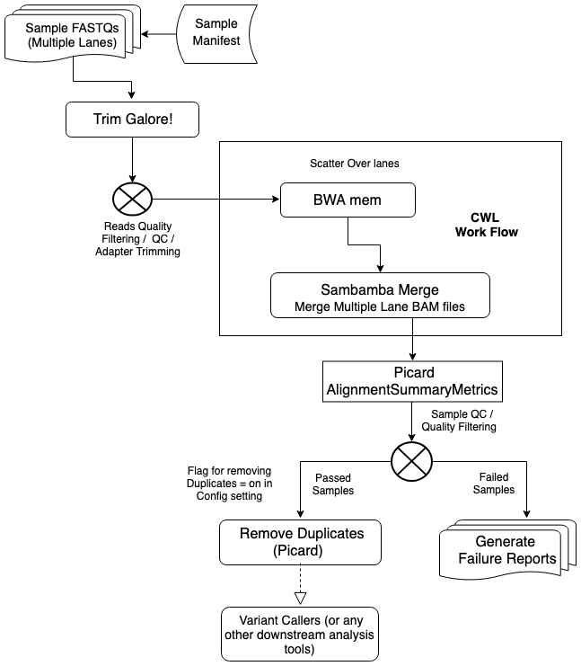

Automation processes multi-lanes FASTQ files into de-duplicated BAMs. Input for this automation is a sample manifest in tab-separated format that specifies sample IDs with corresponding FASTq files. When executed, the automation first finds or creates a project on the Seven Bridges platform into which it copies ("stages") all required files and apps. After setting all required file metadata, computation is performed by spawning platform tasks, one for each app execution step of the automation.

This example features both a static and dynamic conditional that implement QC checkpoints in a non-blocking manner.

The below **[Workflow Diagram](https://github.com/sbg/adk-examples/blob/master/examples/sample-qc/Multi-Lane-sample-QC-diagram.png)** illustrates the steps to complete this NGS Sample QC process: 



Starting from a sample **[manifest file](https://github.com/sbg/adk-examples/blob/master/examples/sample-qc/manifest.tsv)** which defines the metadata of fastq files to be uploaded or already uploaded to the platform,  the workflow first utilizes [Trim Galore! (v0.4.4)](https://igor.sbgenomics.com/public/apps#admin/sbg-public-data/trim-galore/) to perform fastq reads QC and adapter trimming. If a certain number(user defined) of multiple-lane fastq files from the same sample failed, the whole sample will be considered as failed and reports being generated. Only when the certain percentage (user defined) of files from the same sample have passed QC criteria such as quality filter will be sent to alignment step by [BWA mem bundle(v0.1.17)](https://igor.sbgenomics.com/public/apps#admin/sbg-public-data/bwa-mem-bundle-0-7-17/). 

The resulting alignment files from multiple lanes being merged by [Sambamba Merge (v0.5.9)](https://igor.sbgenomics.com/public/apps#admin/sbg-public-data/sambamba-merge-0-5-9/). This alignment and BAM merge steps are handled solely by a CWL workflow and not an automation script, thus BWA can leverage the CWL scattering feature to align fastq files from multiple lanes in parallel jobs (optimization). 

After merge, since each sample is represented by just one alignment file, then [Picard CollectAlignmentSummaryMetrics (v.1.140)](https://igor.sbgenomics.com/public/apps#admin/sbg-public-data/picard-collectalignmentsummarymetrics-1-140/) can now be used to generate alignment QC summary metrics at sample level. Again, only samples that passed alignment QC will be sent to next step such as Mark Duplicates using [Picard MarkDuplicates (v1.140)](https://igor.sbgenomics.com/public/apps#admin/sbg-public-data/picard-markduplicates-1-140/) and other further downstream analysis such as variant calling. Failed samples will be recorded and reported in a separate failure report. This conditional judgement is one of the features that automation handles easily compared to CWL.

System settings, user defined parameters, and run specific settings (apps, path, QC criteria) can be defined and changed easily in a **[Configure File](https://github.com/sbg/adk-examples/blob/master/examples/sample-qc/configs/sample_qc.yaml)** in YAML format. This ensures the flexibility of the program to be quickly adopted to different systems. 

To run this automation script on your computer, issue the following command inside project root directory:

```
python -m sampleqc run --manifest_filename manifest.tsv --config configs/sample_qc.yaml --project_name my_project

```

To successfully run this command, you need to have the Seven Bridges ADK installed. Please contact Seven Bridges if you need access to the ADK.

Note that while the automation script executes locally, locating files and instantiated CWL apps will still be executed on the SB platform. Full local execution where also CWL apps execute on your own computer is currently not supported by the ADK.

